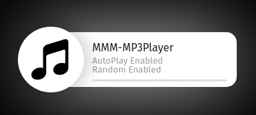

# MMM-MP3Player

## About
A [MagicMirror²](https://github.com/MichMich/MagicMirror/) module for playing music from folder. <br>
This is the version of the [MMM-MP3Player module](https://github.com/asimhsidd/MMM-MP3Player) remade to my needs. <br>
Starting screen: <br>
 <br>
If no album cover found: <br>
 <br>
Album cover retrieved from ID3-Tags: <br>


* supports .mp3, .flac (surprisingly for me, it can be played as 'audio/mpeg' object as well) and .wav music formats;
* reads ID3 metadata (artist and song title) - if no data, the filename is displayed;
* displays album cover. Player tries to retrieve the image from ID3-Tags, otherwise it searches file `cover.jpg` in the playing music file directory.
* autoplay, random order, loop playlist capability;
* current settings of 'autoPlay' and 'random' options are displayed while loading the module;
* control through notifications (play, stop, next track, prev track, turn random on/off);
* module only supports rock music.

## Dependencies
Beside the core modules, this module uses one dependency:

| Module     | URL    |
| -----------|-------------------------------------------|
| node-id3 | https://www.npmjs.com/package/node-id3 |

## Installation

* `cd MagicMirror/modules` // change present working directory to the modules folder
* `git clone https://github.com/x3mEr/MMM-MP3Player.git` // clone the module from github
* `cd MMM-MP3Player` // navigate to the MMM-MP3Player directory
* `npm install` // install dependencies
* Add the following configuration to the modules array in the `MagicMirror/config/config.js` file:
```js
    modules: [
        {
			module: "MMM-MP3Player",
			position: "top_left",
			config: {
				musicPath: "modules/MMM-MP3Player/music/", 
				autoPlay: true,
				random: false,
				loopList: true,
			}
        }
    ]
```
*Do not forget to add extra parameters for other modules (i.e. `classes: "default everyone",` for [face recognition module](https://github.com/nischi/MMM-Face-Reco-DNN))*
* Finally, add some cool music to the `musicPath` folder and enjoy!

## Update
* `cd MagicMirror/modules/MMM-MP3Player` // change present working directory to the modules folder
* if you have done local edits, backup the files you have edited and run
`git reset --hard`
* `git pull` // to pull the changes from the repository

## Configuration

| Option		| Description |
| -----------|-------------------------------------------|
| `musicPath`	| The path of the folder with .mp3 files. <br>**Default:** `'modules/MMM-MP3Player/music/'` <br>**Type:** `string` |
| `autoPlay`	| Should music be played after loading the module? <br>**Default:** `true` <br>**Type:** `boolean` |
| `random`		| Should music be shuffled? <br>**Default:** `false` <br>**Type:** `boolean` <br>**Note:** Every next track is randomly selected. So after the playlist ends the order of tracks will be another. |
| `loopList`	| Loop the tracklist? <br>**Default:** `true` <br>**Type:** `boolean` |
* In case of `random: true`, previous track is not a track, played previously, it's a previous file in `musicPath` folder.

## Control with notifications

The playback can be controlled from another module (e.g. [voicecontrol](https://github.com/alexyak/voicecontrol)) with notifications.
To play track, pause playback, play next or previous track, turn random on/off, following notifications should be send, respectively:
```js
this.sendNotification('PLAY_MUSIC', 'some_info');
this.sendNotification('STOP_MUSIC', 'some_info');
this.sendNotification('NEXT_TRACK', 'some_info');
this.sendNotification('PREVIOUS_TRACK', 'some_info');
this.sendNotification('RANDOM_ON', 'some_info');
this.sendNotification('RANDOM_OFF', 'some_info');
```
