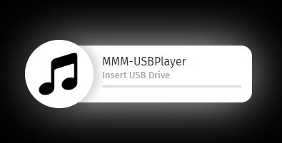
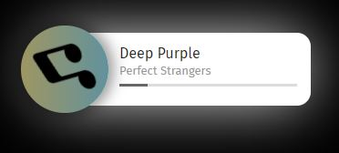

# MMM-MP3Player
A [MagicMirror²](https://github.com/MichMich/MagicMirror/) module for playing music from USB pen drive as soon as it is inserted. A music player object is built inside the module, no iframe is used. The best position is bottom left, although it depends upon the user. The player has nice rounded and shadow borders which adds a nice aesthetic sense to the overall MM. The player then waits for the user to insert/attach a USB pen drive containing the MP3 files. As soon as a USB drive is plugged, the music starts playing!

The module is built with error handling procedures. Beside the core modules, this module uses 3 other dependencies:

| Module     | URL    |
| -----------|-------------------------------------------|
| usb  | https://github.com/tessel/node-usb   |
| node-id3 | https://www.npmjs.com/package/node-id3 |
| drivelist | https://www.npmjs.com/package/drivelist |

 <br>


## Using the module

* Navigate to the modules directory via the follow command: `cd MagicMirror/modules`
* Clone the module from github: `git clone https://github.com/asimhsidd/MMM-MP3Player.git`
* Navigate to the MMM-TracCar directory: `cd MMM-MP3Player`
* Install the dependencies: `npm install`
* Add the following configuration to the modules array in the `config/config.js` file:
```js
    modules: [
        {
			module: 'MMM-MP3Player',
			position: 'top_left'
        }
    ]
```

## Configuration options for MMM-TracCar

| Option    	| Description
|---------------|-----------
| `position`	| *Required* The position of the screencast window. <br>**Options:** `['bottomRight', 'bottomCenter', 'bottomLeft', 'center',  'topRight', 'topCenter', 'topLeft']` <br>**Type:** `string` <br>**Note:** This module config actual sets the location, not the magic mirror position config.
